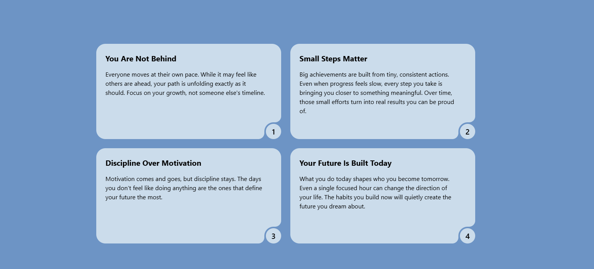

# Motivational Cards App

A clean and responsive motivational cards web app built with **React**, **Vite**, and **Tailwind CSS**. This project displays inspiring messages in beautifully designed cards with a modern UI.

---

## Features

- Dynamic rendering of motivational content from a JSON file
- Clean and modern UI with Tailwind CSS
- Fully responsive design (mobile + desktop)
- Fast performance powered by Vite
- Smart card sizing based on position (alternating layout)

---

## Tech Stack

- **React** – UI library
- **Vite** – Fast development environment
- **Tailwind CSS** – Utility-first styling
- **JavaScript (ES6+)**

---

## Project Structure

```
project-root/
│
├── public/
│   └── data.json        # Motivational data source
│
├── src/
│   ├── components/
│   │   └── Card.jsx     # Reusable card component
│   │
│   ├── App.jsx          # Main app logic
│   ├── App.css
│   └── main.jsx
│
├── index.html
└── package.json
```

---

## How It Works

- The app fetches motivational data from a local `data.json` file.
- Each item is rendered as a card using a reusable `Card` component.
- Cards automatically adjust their width on larger screens to create a visually appealing layout.

---

## Installation & Setup

1. Clone the repository:

```bash
git clone https://github.com/Lanssii/Card.git
```

2. Navigate to the project folder:

```bash
cd card
```

3. Install dependencies:

```bash
npm install
```

4. Run the development server:

```bash
npm run dev
```

5. Open in browser:

```
http://localhost:5173
```

---

## Future Improvements

- Add animations (Framer Motion)
- Fetch data from an API instead of local JSON
- Add categories or filtering for cards
- Dark mode support
- User-generated content

---

## Example Data

```json
{
  "facts": [
    {
      "id": 1,
      "title": "You Are Not Behind",
      "text": "Everyone moves at their own pace..."
    }
  ]
}
```

---

## 🎯 What I Learned

- Working with React components and props
- Fetching and rendering dynamic data
- Responsive design with Tailwind CSS
- Structuring a clean frontend project

---

## Preview



---

## Contributing

Feel free to fork this project and improve it. Contributions are welcome!

---

## License

This project is open-source and available under the MIT License.

---

## Author

Lana Shotashvili
Created with focus and discipline 💙
